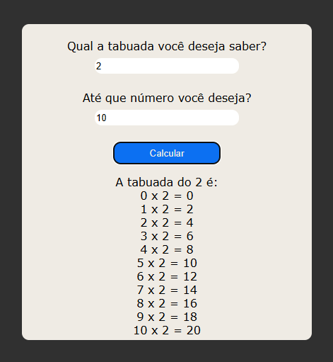

# 📟 Calculadora - JavaScript Puro

<!-- Adicione um screenshot real -->

Uma calculadora funcional desenvolvida com **JavaScript puro**, ideal para praticar manipulação do DOM e lógica de programação.

---

## ✨ Sobre o Projeto

Projeto criado com o objetivo de praticar:

- Event listeners em JavaScript  
- Manipulação dinâmica do DOM  
- Lógica matemática sem uso do `eval()`  
- Design responsivo com CSS Flexbox  

---

## 🎯 Funcionalidades

### 🧮 Operações Básicas
- ✅ Soma, subtração, multiplicação e divisão  
- ✅ Botão de limpar display (`C`)  
- ✅ Suporte a cálculos sequenciais (ex: `2 + 3 * 4`)  

### 🎨 Interface
- ✅ Design responsivo (mobile-first)  
- ✅ Animações CSS nos botões  
- ✅ Feedback visual ao pressionar teclas  

---

## 🛠️ Tecnologias Utilizadas

### Front-End
 
 


#### Recursos Adicionais
- Flexbox CSS  
- Efeitos de transição  
- Media Queries  

---

## 📌 Como Executar

```bash
# Clone o repositório
git clone https://github.com/gilsonjoaoBR/calculadora.git

# Acesse a pasta
cd calculadora

# Abra o arquivo no navegador
start index.html   # Windows
open index.html    # macOS
```

---

## 🌟 Destaques Técnicos

**💡 Solução inovadora:**  
Implementação da lógica matemática **sem uso do `eval()`**, utilizando:  
- `Function()` constructor de forma controlada  
- Tratamento de erros (ex: divisão por zero)  

**🧠 Desafio resolvido:**  
Correção precisa do comportamento do botão `=` em operações sequenciais.

---

## 📸 Screenshots

| Versão Desktop | Versão Mobile |
|----------------|----------------|
|  |  |

---

## 🚧 Melhorias Futuras

### Prioridade Alta
- [ ] Adicionar teclado numérico virtual  
- [ ] Exibir histórico de cálculos  

### Funcionalidades Bônus
- [ ] Modo claro/escuro  
- [ ] Suporte a expressões com parênteses  

---

## 🔗 Links

- 🔹 **Demo Online:** [Ver no Netlify](https://calculadorasalaula.netlify.app/)  
- 🔹 **Repositório GitHub:** [github.com/gilsonjoaoBR/calculadora](https://github.com/gilsonjoaoBR/calculadora)

---

## 👨‍💻 Autor

**Gilson João**  
[](https://www.linkedin.com/in/gilson-jo%C3%A3o-6b775474/)  
[](https://github.com/gilsonjoaoBR)
